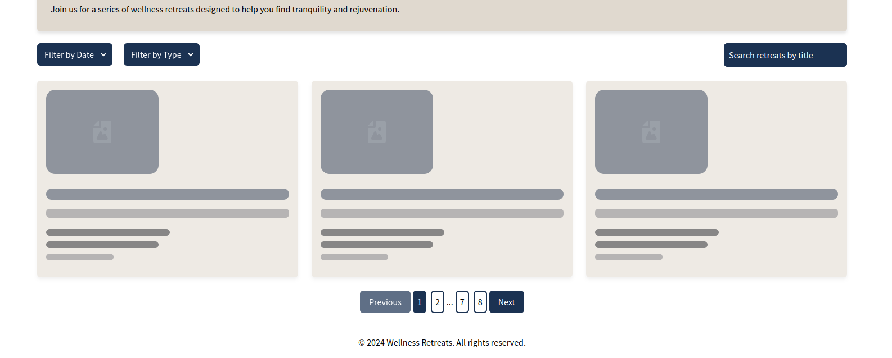
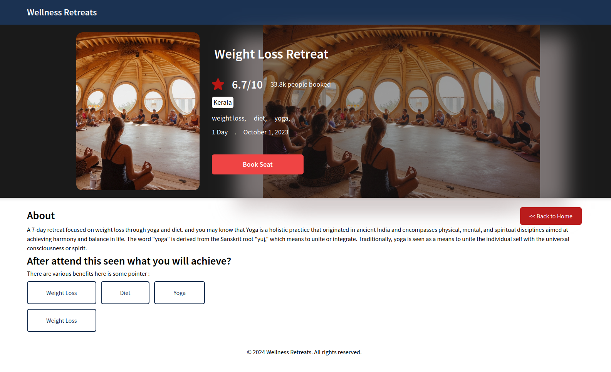

# Getting Started with Create React App

## Installation

Install project with npm
```bash
  git clone https://github.com/github-usman/Shoonya-assignment-frontend
  cd Shoonya-assignment-frontend
  npm install
```
## Environment Variables

To run this project, you will need to add the following environment variables to your .env file

```bash
cp example.env .env
```
## Run application 
```bash
npm start
## OR run in production
npm run build
serve -s build
```

## Project Structure

```bash
public\
src\
 |--assets\            # constants data, also for backup dummy data 
 |--components\        # components 
    |--common\         # common components
    |--pagination\     # Pagination controls  components.
    |--retreats-list\  # Components related to displaying and interacting with retreats.      
 |--contexts\          # Contexts for state management.
 |--layouts\           # Layout of the app like HEADER/FOOTER
 |--pages\             # Main pages of the application
 |--services\          # (service layer) call api
 |--utils\             # Utility functions
 |--app.js             # route management
 |--index.js           # App entry point

```

## Example/Usages
- loading

- Home/landing page

- Details page

    